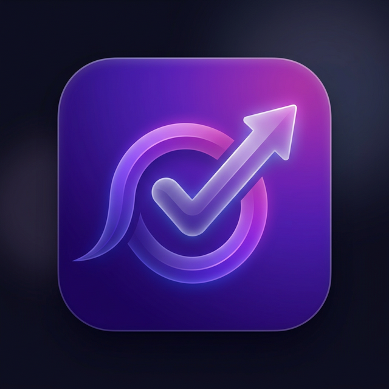

# TaskFlow Pro - Modern Task Manager PWA

TaskFlow Pro is a sleek, modern, and feature-rich Task Manager and Todo List application built with Next.js. It features a stunning glassmorphism UI, robust filtering, and Progressive Web App (PWA) capabilities for an offline-ready experience.



## ✨ Features

- **🚀 PWA Enabled**: Installable on desktop and mobile, with offline persistence.
- **💾 Local Persistence**: All your data is stored securely in your browser's `localStorage`.
- **🎨 Stunning UI**: Modern design with glassmorphism, fluid animations, and a responsive layout.
- **📝 Full CRUD**: Create, Edit, Delete, and Toggle task status.
- **🔍 Advanced Filtering**:
  - Filter by **Status** (Todo, Completed)
  - Filter by **Priority** (High, Medium, Low)
  - Filter by **Category** (Personal, Work, etc.)
  - Filter by **Tags**
  - Real-time **Search** across titles, descriptions, and tags.
- **🔢 Smart Pagination**: Smoothly handle large lists of tasks with ease.
- **🔃 Sorting**: Sort by Due Date, Date Created, Priority, or Title (Asc/Desc).
- **📱 Responsive**: Fully optimized for mobile, tablet, and desktop views.

## 🛠️ Tech Stack

- **Framework**: Next.js (App Router)
- **Styling**: Tailwind CSS (Vanilla CSS variables & Glassmorphism)
- **Icons**: Lucide React
- **PWA**: `next-pwa`
- **Utilities**: `date-fns`, `clsx`, `tailwind-merge`

## 🚀 Getting Started

### 1. Prerequisites

Ensure you have **Node.js** (v18+) installed.

### 2. Installation

Clone the repository (or extract the folder) and install dependencies:

```bash
npm install
```

### 3. Run the Application

Start the development server:

```bash
npm run dev
```

The application will be available at `http://localhost:3000`.

### 4. Build for Production

To test PWA features and production performance:

```bash
npm run build
npm run start
```

## 🧹 Folder Structure

- `/src/app`: Routes and layout
- `/src/components`: UI components (TaskCard, FilterSidebar, etc.)
- `/src/lib`: Logic hooks and storage utilities
- `/src/types`: TypeScript interfaces
- `/public`: Static assets, manifest, and icons

## 📄 License

MIT
